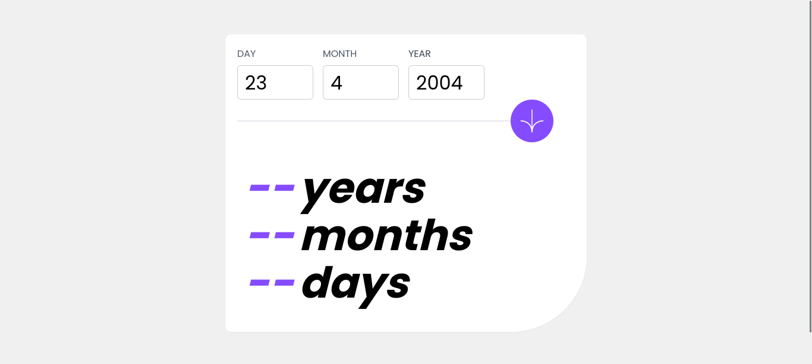

# Frontend Mentor - Age calculator app solution

This is a solution to the [Age calculator app challenge on Frontend Mentor](https://www.frontendmentor.io/challenges/age-calculator-app-dF9DFFpj-Q). Frontend Mentor challenges help you improve your coding skills by building realistic projects.

## Overview

Eu estou Feliz com o meu Progresso Até aqui e Fico feliz por aprender mais através destes
exercícios que o Frontend Mentor tem Criado. Desde já fico feliz por aprender mais sobre Javascript
DOM.

### The challenge

Users should be able to:

- View an age in years, months, and days after submitting a valid date through the form
- Receive validation errors if:
  - Any field is empty when the form is submitted
  - The day number is not between 1-31
  - The month number is not between 1-12
  - The year is in the future
  - The date is invalid e.g. 31/04/1991 (there are 30 days in April)
- View the optimal layout for the interface depending on their device's screen size
- See hover and focus states for all interactive elements on the page
- **Bonus**: See the age numbers animate to their final number when the form is submitted

### Screenshot



### Links

- Solution URL: [Add solution URL here](https://your-solution-url.com)
- Live Site URL: [[Add live site URL here](https://your-live-site-url.com)](https://mariosalembe23.github.io/AgeCalculator-FM.github.io/)

## My process

Foi muito Bom poder Resolver este Exercício e sinceramente pude Recordar muita Coisa que
há muito Tempo Aprendi em Javascript como WORKING WITH DATES.

### Built with

- Semantic HTML5 markup
- CSS custom properties
- Flexbox
- Tailwind CSS

### What I learned

Use this section to recap over some of your major learnings while working through this project. Writing these out and providing code samples of areas you want to highlight is a great way to reinforce your own knowledge.

To see how you can add code snippets, see below:

```js
for (const input of inputs) {
  input.addEventListener("keydown", function (event) {
    // Obtém o código da tecla pressionada
    const tecla = event.key;

    // Verifica se a tecla pressionada é um número ou a tecla backspace
    if (!(/[0-9]/.test(tecla) || tecla === "Backspace")) {
      // Se não for um número nem a tecla de apagar, previne a ação padrão (não insere o caractere)
      event.preventDefault();
    }
  });
}


### Continued development

Eu vou me Focar em Trabalhar mais os eventos do Javascript e Flexbox o que é muito importante para os
layouts e Dominar as demais Configurações que eu Posso Adaptar ao meu Tailwind CSS.


## Author

- Website - [Add your name here](https://www.your-site.com)
- Frontend Mentor - [@yourusername](https://www.frontendmentor.io/profile/yourusername)
- Twitter - [@yourusername](https://www.twitter.com/yourusername)

**Note: Delete this note and add/remove/edit lines above based on what links you'd like to share.**

```
